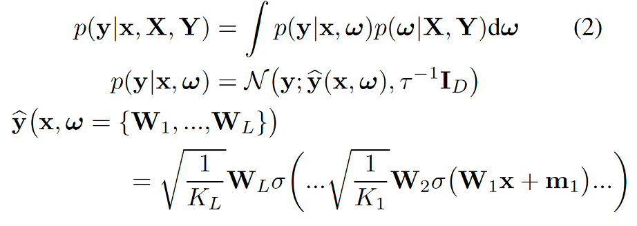
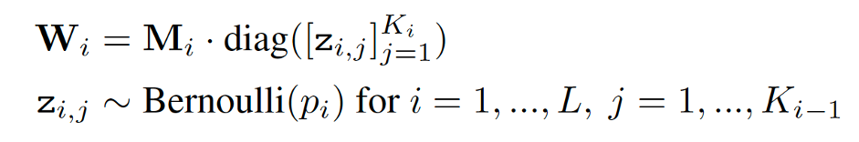
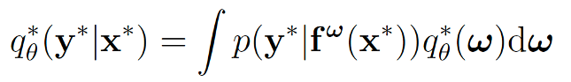

### Dropout as a Bayesian Approximation- Representing Model Uncertainty in Deep Learning

---

#### Abstract

많은 관심을 받던 딥러닝 기술 (regression, classification) 은 모델 불확실성을 나타내지 못한다. 비교로, 베이지안 모델은 모델 불확실성을 추정하긴 하지만 많은 비용이 든다. 이 논문에서는 딥러닝에서의 드롭아웃이 가우시안 분포의 베이지안 추정과 근사한다는 것을 보여준다. 그러므로써 계산적으로 복잡함 없이 딥러닝의 불확실성을 나타낸다. 실험에서는 Regression 과 MNIST 를 사용한 classification 에서 다양한 네트워크를 평가한다. 그리고 현재의 방법과 비교하여 우리의 방법이 RMSE 와 predictive log-likelihood 의 상당한 향상을 보여주고, 끝으로 강화학습에서의 드롭아웃 불확실성을 사용에 대해서 설명한다.

#### 1. Introduction

Regression 과 classification 에서 쓰이는 standard 딥러닝 기술은 모델의 불확실성을 나타내지 않는다. Classification 에서는, 소프트맥스 아웃풋(파이프라인 마지막단계)의 예측 확률 값이 종종 모델의 confidence 라고 잘못 해석되어 진다. 모델이 소프트맥스의 높은 아웃풋을 가질지라도 불확실할 수 있기도 하다. 그림 1 을 보자.

왼쪽 (소프트맥스 인풋), 오른쪽(소프트맥스 아웃풋), x* (트레이닝 데이터로 부터 멀리 떨어진데이터)

\- 트레이닝 데이터로부터 멀리 떨어진 데이터에 대해 높은 컨피던스와 함께 나타난다. x* 같은 경우 1의 확률로 분류되고 있다. 하지만 distribution 을 소프트맥스에 통과시킨 결과는 트레이닝 데이터로부터 멀리 떨어진 데이터에 대한 불확실성을 잘 반영해준다.

모델의 불확실성은 딥러닝에서 매우 중요하다. 예를 들어 우체국에서 문자를 분류하는 작업에서 모델이 높은 불확실성을 나타낸다면, 분류작업을 사람에게 넘겨줄 수 도 있다. 또한 강화학습에서도 중요한데, 에이전트는 불확실성을 가지고, explore 할 지, exploit 할 지를 결정할 수 있다. 최근 RL 은 Q-value function approximation 네트워크를 사용하고 있는데, 이 함수는 에이전트가 취한 각 행동의 퀄리티를 측정해준다. Epsilon greedy 는 확률을 가지고 best action 을 고르도록 할 때 종종 사용된다. 에이전트의 Q-value function 을 걸쳐 불확실성을 평가하면 Thompson sampling 과 같은 기술이 학습을 더 빨리하는데 사용될 수 있다.

우리는 뉴럴네트워크에서 드롭아웃이 잘 알려진 확률모델인 가우시안 프로세스의 베이지안 추정방법으로 해석 될 수 있다는 것을 보인다. (so, 계산적 복잡함과 test accuracy의 희생없이 모델의 불확실성에 대한 문제를 완화할 수 있다.)

이 논문에서, 드롭아웃 뉴럴네트워크로 부터 얻은 불확실성에 대해 평가하고, 다른 모델로 부터 얻은 불확실성과 비교한다. 

#### 2. Related Search

무한한 뉴럴네트워크 분포(weights에 걸친)는 가우시안 프로세스에 수렴한다는 것은 오래 전부터 알아왔다. 유한한 NN에 대한 분포는 베이지안 뉴럴네트워크로 연구되어왔는데, 이것은 오버피팅에 대한 robustness 를 제공하지만 추정과 계산적 비용의 과제가 존재한다. Variational Inference (VI) 가 이런 모델에 적용되어 왔다. 이상, VI 의 최근 연구에 대한 설명.

#### 3. Dropout as a Bayesian Approximation

우리는 모든 weight layer에 드롭아웃을 적용한 비선형, 임의의 깊이의 뉴럴네트워크가 수학적으로 확률적 가우시안 프로세스의 근사치와 동일하다는 것을 보인 다. 드롭아웃이 (근사하는 분포와) 딥 가우시안 프로세스의 posterior 사이의 KL-Divergence를 줄인다는 것도 보인다.

\+ 드롭아웃, 가우시안 프로세스, VI 에 대한 설명은 appendix section2, 3 에 있다. 여기서는 그에 대해 요약만하고 다음장에서는 Uncertainty 를 얻는 방법을 설명한다.
$$
\hat{y} : L 개의 \, Layer와 \, Loss \,function \;Ε(.,.) 의 \,NN \,모델의 \,output
\\
\mathcal{W}_i : (K_i\ *\ K_{i-1}) \, 크기의\, NN \,weight \,matrix
\\
b_i : K_i \, dimension 의\, bias \,vector
\\
y_i: input \;x_i 에 \;일치하는 \;관찰된\; output \;(for\, x_i 1 \le\ x_{i\ \ }\le\ N\,)
\\
X, Y : input\, 과 output\, 의\; 데이터 \,집합
$$
NN  optimization 동안, regularization term 이 추가되는데, 우리는 $\lambda$ weight L2 regularisation 을 사용한다.  결과로 다음의 objective 를 minimize 하는 쪽으로 optimization 한다.

드롭아웃에서는, 각 layer 의 네트워크 unit 과 모든 input 에 대해서 binary variables 를 샘플링한다. 각각의 binary variable 은 layer i 에서 $\p_i$ 확률과 함께 1을 갖는다. 만약 주어진 input 에 대응하는 binary variable 이 0이라면, 그 unit 은 drop 된다. 이 값은 backward pass propagating 에서도 동일하게 사용된다.

Non-probabilistic NN 에 비해서, deep Gaussian process 는 통계학에서 매우 강력한 tool 이다. 이는 모델의 distribution 도 가능하게 하는데, 다음과 같은 형태의 covariance function이 있다고 가정한다. (비선형 함수 $\sigma$, p(w), p(b) 의 distribution)

Appendix의 section3,4 에서 Layer L 의 딥 가우시안 프로세스와 covariance function K(x, y) 가 GP의 covariance function 의 spectral decomposition 의 각각의 컴포넌트에 따른 variational distribution 을 놓음으로써 근사될 수 있다는 것을 보인다. 이에 대해서 간단하게 설명한다.
$$
\mathcal{W}_i : (K_i\ *\ K_{i-1}) 크기의 NN weight matrix \\
w\ =\ {\mathcal{W}_i}\ (i=1\ ~\ N) \\
우선, 우리는 \,\mathcal{W}_i 의\, 각각의 \,행을 \,p(w)\, 에 따라 \,분배한다. \\
그리고 \,각 \,GP\, 레이어에 대해서\, K_i\, dimension 인 \,m_i\, vector 를\, 가정한다.\\
Precision parameter \;\tau > 0 \,가 주어진\, GP \,모델의 예측 가능한 \,probability \,는 \,다음과 \,같이\, parametrize \,될\, 수 \,있다.
$$

Posterior distribution 인 p(w|X, Y) 는 intractable 하기 때문에 posterior에 근사하도록, 우리는 column 이 random 하게 0으로 정해져있는 행렬 q(w) distribution 을 사용한다. 

다음과 같이 q(w) 를 정의한다.

Binary variable  = 0 은 (i-1) layer 의 unit j 가 다음 i layer 의 인풋으로서 dropout 을 되는 것을 말한다. Variational distribution 인 q(w) 는 매우 multimodal 하고 matrix  의 의 행에 대한 모든 강한 correlations 를 줄여준다.(이것은 sparce spectrum 의 GP 근사법과 일치)

우리는  deep GP 의 posterior p(w|X, Y) 와 그에 근사하는 q(w) 사이의 KL-Divergence 를 minimize 한다. 우리가 줄여야 할 object는 다음과 같다.

이 식의 첫번째 term 을 sum 으로 바꾸면 다음의 식이 된다.

각각의 term 은 unbiased estimate 를 얻기 위해서, Monte Carlo integration 의 합으로 근사될 수 있다. (with a single sample ). 게다가 두번째 term 을 prior length-scale l 을 사용해서 근사할 수 있다. (appendix section 4.2 에 나와있음.) 그래서 (3) 식을 확장해 다음의 식을 얻을 수 있다.

Setting)

베르누이 distribution z 로 부터 샘플링된  이 dropout 케이스에서 binary variables 와 동일하다.

#### 4. Obtaining Model Uncertainty

위의 식으로 부터 dropout NN 모델의 Uncertainty 를 얻을 수 있다. Appendix 의 Section 2.3 에 따르면, 우리의 근사하는 predictive distribution 은 다음의 식이다.

우리는 새로운 x* 에 대한 output y* 에 대한 평균과 분산을 구한다.

- 평균

모델을 T 번 통과해서 평균을 낸 것 -> predictive mean

- 분산

Var[X] = E[X] – E[X^2] 를 사용해서,

​		E[X^2]

​		Var[X]		

이 분산이 바로 **Uncertainty** 이다.

#### 5. Experiments

우리는 다음 4가지를 보인다. 

- **Model Uncertainty in Regression Task**

CO2 데이터 셋 을 사용해서, train 한 모델의 Output 에 대한 predictive mean 과 uncertainty (분산) 에 대한 그림이다.

파란색 점선까지 training dataset 영역을 나타내고, 그 이후는 training dataset 에 포함되지 않는 데이터들을 나타낸다. (x* 은 training dataset 에 포함되지 않는 data)

그림에서 shaded 영역이 **Uncertainty** 를 나타낸다.

Standard dropout 를 제외한 나머지 모델이 output 에 대한 Uncertainty 를 나타내고 있다.

Standrad output : 높은 confidence 로 x* 에 대해 0으로 예측한다. (트레이닝 데이터로부터 멀리 떨어져있는 데이터임에도 불구하고)

GP model: training data 영역을 벗어난 data에 대해서 Uncertainty 를 나타낸다. 모델은 그 ood(Out-of-distribution) 에 대해 0 으로 예측하지만,  예측한 Uncertainty 는 높다는 것을 말해준다.

Relu 를 사용한 MC-dropout: 데이터가 training data 영역으로부터 멀어질 수록 Uncertainty 가 증가하는 것을 볼 수 있다.

- **Model  Uncertainty in Classification Tasks**

Lenet에 대해서 rotation 한 1 이미지에 대한 softmax 의 input과 output 에 대한 그림이다.

(a) : 모델은 회전된 '1' 의 이미지를 각각 [1 1 1 1 1 5 5 7 7 7 7 7] 로 예측하고 있다.

모델은 높은 confidence 로 5로 예측하고 있다는 것을 볼 수 있다.

(b) : 5로 예측한 결과에 대한 **Uncertainty** 를 나타내고 있다.

이 결과를 통해서 input 에 라벨의 외부의 annotator 를 기대할 수 있다.

(5로 나왔지만 Uncertainty 가 높게 나왔다는 것을 통해 불확실하다는 추가적인 정보를 얻을 수 있다는 말.)

- **Predictive Performance**

생략

- **Model Uncertainty in Reinforcement Learning**

**Uncertainty** 는 강화학습에도 중요한 task 가 될 수 있다. Uncertainty 정보를 가지고, agent 가 언제 exploit 하고 explore 할 지 결정할 수 있다. 

**Uncertainty** 를 사용한 Thompson sampling 방법이 Epsilon greedy 보다 더 빨리 보상을 얻었다.

#### 6. Conclusions and Future Research

생략

# Reference 

[Dropout as a Bayesian Approximation : Representing Model Uncertainty in Deep Learning - Yarin Gal, Zoubin Ghahramani](https://arxiv.org/abs/1506.02142)

